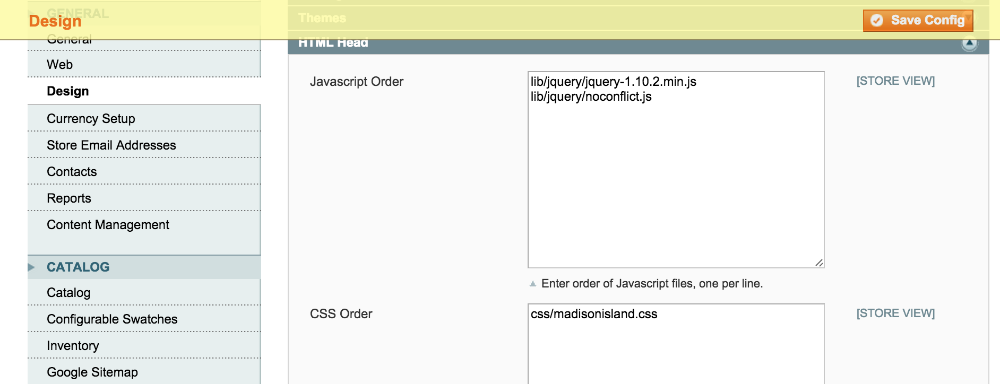

Head Order
==========
Order Javascript and CSS files in the head block.

Description
-----------
In the Magento layout, you can add Javascript and CSS files to the head block. 
The order of these files depend on the order they were declared in the layout
XML and updates and there's no way to specify the order. This extension allows 
you to specify the order of JS and CSS files in the admin System Configuration.
When Magento renders out the head block, this extension will reorder the head
files as specified by you.

How to use
----------

The order of the files can be specified in the admin, under System -> 
Configuration -> General -> Design -> HTML Head:

